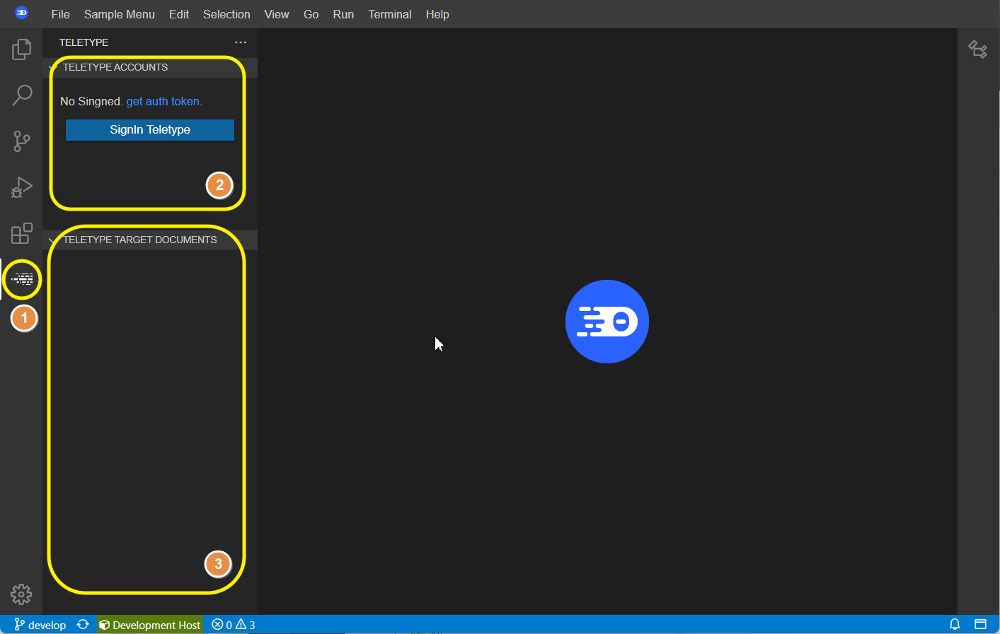
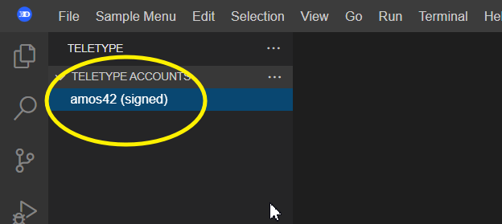
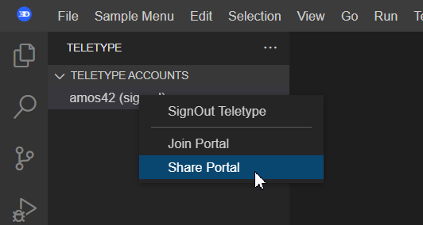
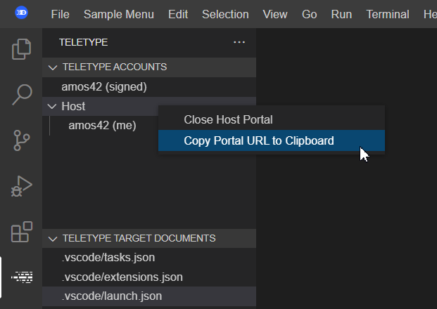
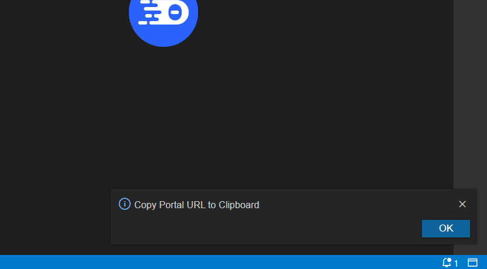
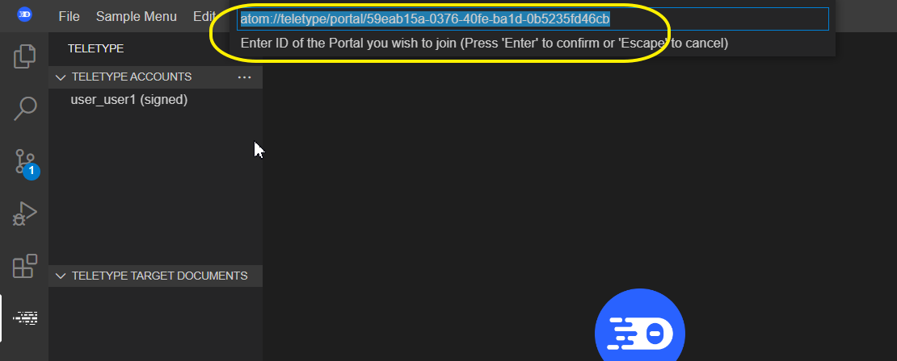
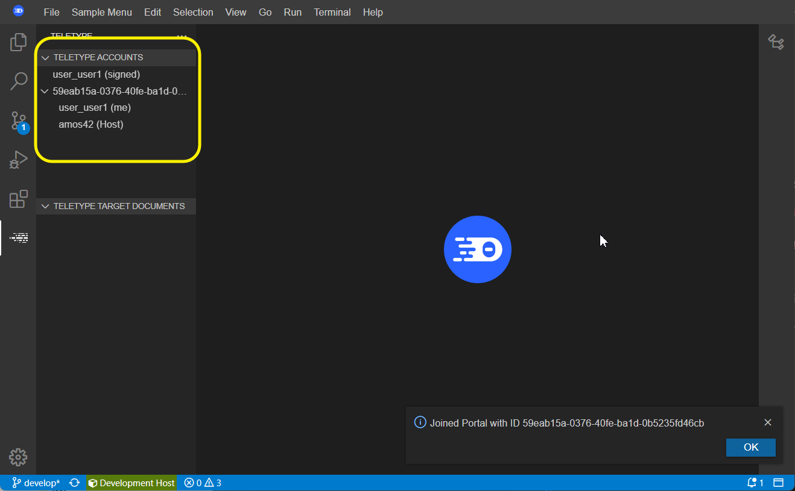
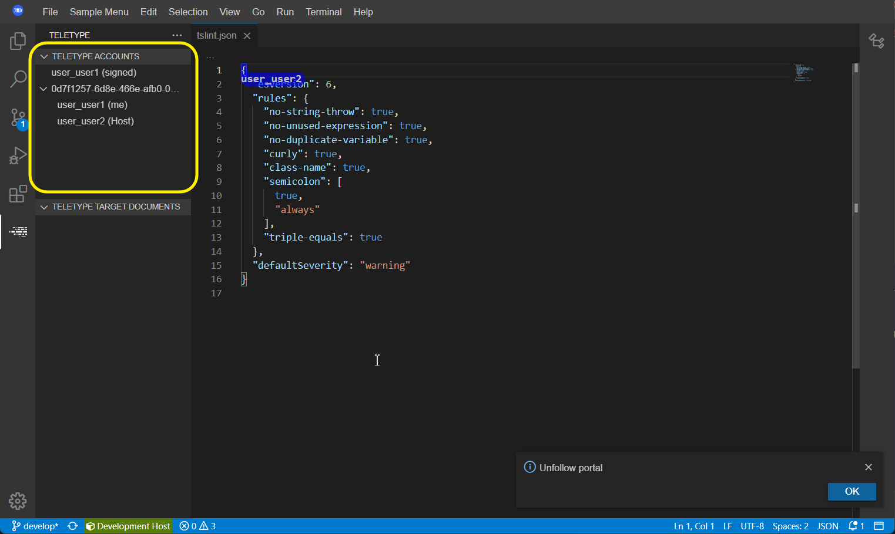
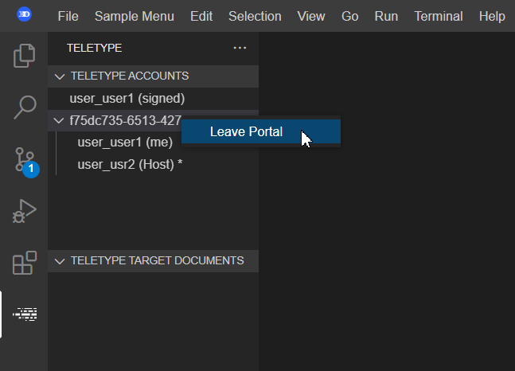

# vscode-teletype

**Teletype for VisualStudio Code and Theia and Code-Server**

---

<p align="center">
  <p align="center">
    <a href="README.md">English</a>
    ·
    <a href="README_kr.md">한국어</a>
  </p>
</p>

---

## Eclipse Che에서 Teletype 실행

Eclipse Che에서 Teletype을 사용하기 위해서는 Devfile에 플러그인을 추가해 주면 된다.  
Add Workspace를 클릭하여 워크스페이스를 생성하기 위한 Devfile 입력 박스가 나타면 다음의 내용을 입력한다.

> data
```yaml
apiVersion: 1.0.0
metadata: 
  name: Teletype-test-1
  projects:
    - name: official-testcase-spring1
      source:     
        location: 'https://code.sdsdev.co.kr/cloud-ide/official-testcase-spring1.git'
        type: github
components:
  - id: sds/Teletype/latest
    type: chePlugin
```

그리고 Create & Open 버튼을 클릭하면 생성 된 IDE에 Teletype이 설치되어 동작하게 된다.  
정상적으로 Teletype이 설치되었다면 IDE의 페이지탭에 Teletype 아이콘이 표시된다.

Teletype 탭을 클릭하면 Teletype 페이지로 전환된다.


각 뷰의 요소는 다음과 같다.



> **1 - Teletype 페이지탭**  
> Teletype 페이지로 전환
> 
> **2 - Teletype Accounts**  
> Teletype 접속 정보 및 계정 정보
> 
> **3 - Teletype Target Documents**  
> 현재 공유 중인 에디터 목록


## Teletype Sign-in

Teletype을 사용하기 위해서는 제일 먼저 서버에 접속하여 인증 작업을 마쳐야 한다.

상단의 Teletype Accounts 뷰의 Signin 버튼을 누른다.
그럼 user id 입력 받는 입력박스가 나타난다.


유저 이름을 입력하고 enter를 누른다.  
접속이 성공적으로 이루어지면 Teletype Accounts 뷰에서 Signin 버튼이 사라지고 접속한 유저의 이름이 표시된다.




## Teletype Signout

Teletype의 사용을 더이상 원치 않는다면 서버로부터 접속을 끊으면 된다.

Teletype Accounts 뷰의 user 이름 항목을 우클릭하여 팝업 메뉴를 호출한다.


팝업 메뉴 중, Signout Teletype 을 클릭한다.
그럼 Teletype Accounts 뷰의 tree에서 계정 항목이 사라지고 다시 Signin 버튼이 나타난다.


## 소스를 공유하기 (Host)

현재 자신의 Workspace 상의 소스를 공유하고자 한다면 먼저 Host로서 공유 Portal을 생성하고 그 Portal을 공개해야 한다. 그럼 다른 유저들이 해당 Portal에 접속하여 Guest로서 참여하여 Host가 제공하는 소스를 공유할 수 있게 된다.

공유 Portal을 생성하려면 Teletype Accounts 뷰에서 유저 이름 항목을 우클릭하여 팝업 메뉴를 호출한다.



팝업 메뉴 중 Shared Portal를 선택하여 Portal을 생성한다. 성공적으로 Portal이 생성되면 팝업 메시지와 함께 Teletype Accounts 뷰에 Host 항목이 추가된다.


Host 항목의 하단에 현재의 유저 이름이 기본으로 추가된다.  
또한 생성된 Portal의 접속 URL이 클립보드로 들어가게 되는데, 이를 적절한 방법으로 공유하고자 하는 유저들에게 전달하면 된다. (ex. 메신저, e-Mail, etc...)


## 공유 Portal URL을 클립보드로 복사

만약 작업 도중에 새로운 사용자에게 공유 Portal의 접속 URL을 전송해야 할 경우가 생긴다면 클립보드를 통해 해당 URL을 얻을 수 있다.

먼저 Teletype Accounts 뷰에서 Host 항목을 우클릭하여 팝업 메뉴를 호출한다.



팝업 메뉴 중 Copy Portal url to clipboard 항목을 클릭하면 팝업 메시지가 표시되며 Portal의 접속 URL이 클립보드로 복사된다.



> ***Info:*** 이 작업은 Portal의 Host 유저만이 가능하다.


## 공유 Portal에 Guest로 접속

이미 생성 된 공유 Portal에 Guest로서 참여하여 Host 유저가 제공하는 소스를 열람하기 위해서는 사전에 다른 유저가 해당 Portal의 접속 URL을 알고 있어야 한다. 이 접속 URL은 Host 유저가 임의의 방법(ex. 메신저, e-Mail, etc...)으로 다른 유저들에게 전달해 주어야 한다.
공유 Portal의 URL을 알고 있다면, Teletype 접속 후 해당 Portal에 접속하면 됩니다.

Teletype Accounts 뷰에서 Signin 된 유저 이름 항목을 우클릭 하여 팝업 메뉴를 호출한다.


팝업 메뉴 중, Join to Portal을 선택하면 Portal URL 입력 창이 나타난다.  
입력창에 Portal URL을 입력하고 enter를 누른다.



성공적으로 Portal에 접속이 되었다면 Teletype Accounts 뷰에 Portal Id 항목이 나타나고, 그 아래에 Host 유저의 이름과 현재 Signin 된 유저 이름이 함께 나타난다.



> ***info:*** 만약 Host 유저가 편집 중인 파일이 존재한다면 해당 파일의 소스가 함께 에디터로 열리게 된다.


## 팔로잉 대상의 에디터 변경 동기화

Teletype의 기본 사용 패턴은 서로 다른 유저가 같은 소스를 동시에 열람하는 것이다. 때문에 한 유저가 편집 대상 소스를 다른 파일로 변경했을 때 다른 유저 역시 즉각적으로 해당 소스를 함께 열람할 수 있어야 한다.  
이때 소스의 대상을 가리키는 유저를 **리더**라고 부르고 이 소스를 열람하는 유저를 **팔로어**라 부른다.  
기본적으로 초기엔 소스를 공개하는 Host가 디폴트로 리더가 되어 있고, 다른 Guest는 모두 이 리더를 팔로잉하게 된다.  
하지만 필요에 따라 이 리더의 대상 소스의 변경을 계속 팔로잉하는 것이 불필요해지는 경우도 있다. 이럴 땐 팔로잉을 끊으면 된다. 유저가 명시적으로 팔로잉을 끊을 수도 있지만, 에디터 조작하는 상황에 따라서 Teletype이 지능적으로 팔로잉을 끊을 수도 있다.  
또한 계속 복수의 유저가 동시에 Portal에 접속한 상태에서는 자신이 주목하고자 하는 특정 유저를 골라서 팔로어가 될 수도 있다.

> ***info:*** Host 유저는 기본적으로 리더만 될 수 있을 뿐, 팔로어는 될 수 없다.

초기 Portal에 접속한 상태에선 Teletype Accounts 뷰에 Host 유저의 이름 옆에 * 문자가 표시되어 있다. 이는 현재 팔로잉하는 대상이 Host 유저임을 나타낸다.


이 상태에서는 Host 유저가 편집할 파일을 열거나 편집 중인 대상 파일을 변경하면 즉시 해당 파일에 해당하는 에디터가 함께 열리게 된다.

만약 팔로잉을 끊고 싶다면 Teletype Accounts 뷰에 Host 유저 이름에서 마우스 우클릭을 하여 팝업 메뉴를 호출한다.


팝업 메뉴 중 Unflollow Portal을 클릭하면 Unfollow 되었다라는 팝업 메시지와 함께 Host 유저 이름의 옆에 * 표시가 사라진다.



이 상태에서는 Host 유저가 새로운 파일을 열거나 편집 중인 에디터를 변경해도 Guest 유저의 화면에서 즉각적으로 해당 에디터가 함께 열리지 않게 된다.

다시 특정 유저의 공유 파일 편집 상태를 팔로잉하고자 한다면 해당 유저를 리더로 지정하면 된다. 반드시 Host 유저 뿐 아니라 복수의 유저가 접속했을 경우, 임의의 유저도 리더로 지정하는 것이 가능하다.

Teletype Accounts 뷰에서 팔로잉하고자 하는 유저의 아이디를 우클릭해서 팝업 메뉴를 호출한다.


Flollow Portal을 클릭하게 되면 팔로잉했다라는 메시지가 출력되면 해당 유저의 우측에 * 문자가 나타나게 된다. 또한 현재 해당 에디터가 편집하고 있던 소스가 있다면 해당 파일도 즉각적으로 표시되게 된다.


## Host 모드에서 에디터 열기

기본적으로 Portal을 통해 공유되는 소스 파일들은 Host 유저가 제공하는 워크스페이스 상의 텍스트 파일로 한정된다. 즉, 오직 Host 유저만이 소스를 제공할 수 있고, Guest 유저의 소스는 공유 될 수 없다.  
그래서 소스 공유를 원하는 유저는 먼저 자신이 Host가 되어 Portal을 열고, 이후에 자신의 워크스페이스 상의 파일을 스스로 열어줘야 한다.

기본적으로 Teletype Target Documents 뷰에는 현재 워크스페이스의 파일 중, 활성화 된 문서의 목록이 나타난다.


> ***info:*** 에디터 영역에는 나타나지 않지만 IDE 내부적으로 활성화 된 파일도 목록에 나타난다.

Host 모드로 소스 공유를 시작했다면, 이제 IDE의 Explore 탭으로 이동하여 워크스페이스의 파일 목록으로 이동해야 한다.


워크스페이스 상에 존재하는 임의의 파일을 클릭하여 열어 준다.  


이제 다시 Teletype 페이지 탭으로 이동하여 보면 새롭게 열린 파일이 Teletype 탭의 Teletype Target Documents 목록에 추가되게 된다.  
또한 Guest 유저 역시 즉각적으로 Host 유저가 공유 한 파일의 목록이 표시되며, 팔로잉 상태에 있다면 해당 파일이 즉시 에디터로 열리게 된다.


## 에디터의 커서 위치 변경

Host 유저와 Guest 유저 사이, 혹은 Guest 유저와 또다른 Guest 유저 사이에서 공유하고 있는 문서에서의 커서 위치를 모두가 공유할 수 있게 된다.

문서의 특정 위치로 마우스를 클릭한다. 커서의 위치가 해당 위치로 이동된다.


Host 모드에서 연 문서에 해당하는 에디터가 에디터 영역에 표시되어 있다.
Host 모드의 에디터에서의 커서 위치에 마크가 되어 있으며, Host 모드의 유저 아이디가 표기되어 있다.

Host 모드의 에디터에서의 이동한 새로운 커서 위치에 마크가 되어 있으며, Host 모드의 유저 아이디가 표기되어 있다.


Host 모드의 Teletype이 포함 된 워크스페이스에서 열려 있는 에디터를 선택하고 마우스로 드래그하여 텍스트 영역의 일부를 블럭으로 선택한다.


그럼 Guest 유저의 에디터에서도 해당 영역과 동일한 영역에 마커가 칠해져 있다.


## 편집 동기화

서로 공유되고 있는 문서를 한 유저가 편집하게 되면 다른 유저들의 에디터에도 즉각적으로 해당 편집 내용이 표시된다.

에디터의 임의의 위치로 커서를 이동하여 임의의 텍스트 내용을 입력한다. 그럼 다른 유저의 에디터에도 동일한 위치에 동일한 문자열이 표시되어 보인다.


편집 내용의 동기화는 일방향으로 이루어지지 않는다. 각 유저가 동시에 서로의 에디터를 편집하더라도 그 편집 내용이 쌍방향으로 서로의 에디터에 즉각 반영된다.


## 서로 다른 파일을 편집하고 있을 떄 동기화

Host 유저 혹은 다른 Guest 유저와 팔로잉이 끊어진 상태라면 일반적으로 서로 다른 파일을 에디터 상에서 표시하고 있는 상태가 될 수 있다.  
그 상태에서 문서를 편집한다면 즉시 해당 내용이 다른 유저들의 에디터에 반영될 수 없다. (이는 Visual Studio Code와 Theia의 정책에 따른 이슈이다.) 때문에 이런 편집 내용은 일단 pending 상태가 되었다가 적절한 순간이 되면 그제서야 실제로 반영된다.

먼저 Host 유저가 복수개의 파일을 열어 놓았다고 가정한다. 그 상태에서 Guest 유자가 임의로 다른 에디터를 선택한다면 팔로잉이 끊기게 된다. (Teletype Accounts 뷰의 Host 유저 이름 옆의 *가 사라진다.)


이렇게 팔로잉이 끊기고 서로 다른 에디터에 포커싱이 되어 있는 상황에서는 편집을 진행하면 즉시 편집 내용이 반영되지는 않지만 대신 문서에 변경이 이루어지고 있다는 사실은 표시된다.  
Teletype Target Documents 뷰에 나열 된 파일 목록 중, 현재 변경이 이루어지고 있지만 아직 동기화가 이루어지지 않은 파일의 옆에 * 문자가 표시된다.


실제로 동기화가 이루어지는 시점은 해당 에디터가 활성화 되는 순간이며, 그 전까지는 반영을 미루고 있는 pending 상태인 것이다.

Teletype Target Documents 뷰에 나타난 파일명 중 * 문자가 붙은 항목을 클릭하여 해당 에디터를 활성화시키면 그 즉시 변경한 내용이 실제로 반영되어 텍스트 내용이 변경 된 모습을 볼 수 있다.  
이렇게 지연 된 동기화가 완료되면 Teletype target documents 뷰에 나타난 해당 에디터의 파일명 옆에 표시되어 있던 * 문자 역시 사라진다.


## Guest 접속 종료

Guest 유저가 소스 열람을 끝내고 싶다면 Portal의 접속을 끊으면 된다.

Teletype Accounts 뷰의 Host ID 항목을 마우스 우클릭하여 팝업 메뉴를 호출한다.



팝업 메뉴에서 Leave Portal을 클릭하면 접속을 종료하게 된다.  
접속 종료가 완료되면 Teletype Accounts 뷰에서 Host의 ID 항목이 사라진다. 또한 열람 중인 공유 소스의 목록이 표시되던 Teletype Target Documents 뷰의 목록 중에 해당 Portal의 소스들은 사라지게 된다.


## Teletype Host 닫기

Host 유저가 더이상 소스 공유를 중단하고 싶다면 Portal을 닫으면 된다.

Teletype Accounts 뷰에서 Host 항목을 우클릭 하여 팝업 메뉴를 호출한다.


팝업 메뉴 중 Close Host Portal 항목을 클릭하면 접속이 종료 되었다는 팝업 메시지가 출력되며, Teletype Accounts 뷰에서 Host 항목이 사라진다. 또한 현재 공유 중인 에디터의 목록에서도 모든 항목들이 사라진다.


Host 유저가 Portal을 닫을 땐 한가지 주의 사항이 있다. 바로 Guest 유저가 편집 한 내용이 아직 반영되지 않은 상태에서 종료를 하면 편집 내용을 잃게 된다는 점이다.  
일례로, 현재 Host 유저와 Guest 유저의 팔로잉이 끊긴 상태에서 Guest 유저가 Host에게 보이지 않는 에디터의 내용을 편집 중인 상태를 가정해 보자.  
그럼 Guest 유저의 Teletype Accounts 뷰에서는 팔로잉을 표시하는 * 문자가 사라져 있을 것이다. 
이 상태에서 Guest와 Host가 서로 다른 에디터를 바라보고 있을 수가 있다. 이때 Guest가 문서의 내용을 편집한다면 Host 유저의 Teletype Target Documents 뷰에는 Guest가 편집 중인 파일명의 옆에 * 표시가 나타난다.


이때 Host 유저가 워크스페이스의 공유를 중단하고 Portal을 닫으려고 시도하려면 팝업 메뉴를 통해 종료 명령을 내리면 된다.


만약 이때 미반영 된 편집 내용이 있다는 경고 메시지와 함께 종료 확인 팝업창이 나타난다.


만약 여기서 Yes를 누른다면 Portal이 정상적으로 종료되지만 대신 미반영 된 편집 내용은 잃게 된다.
미반영 된 내용을 확인하고 적용한 이후에 다시 종료 절차를 밟고 싶다면 No를 누르면 된다. 그 경우 팝업창이 닫히고 종료 절차가 취소된다.
